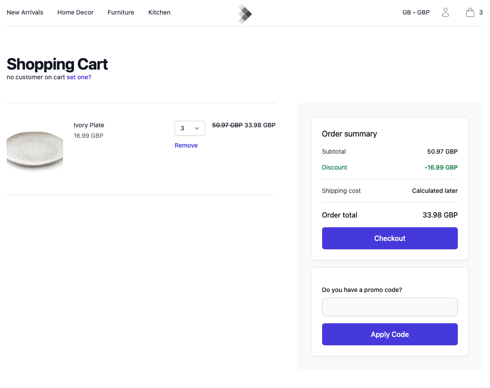

# Dovetech commercetools Connector Demo

This site provides an example of how to use commercetools with the [Dovetech Campaigns Connector](https://github.com/dove-technology/commercetools-campaigns-connector).

**Note. This is not an example of how to build an ecommerce site with commercetools. It
provides an example of how to integrate commercetools and Dovetech using the Dovetech connector.**

Below is an example of the cart page from the demo:



## Prerequisites

1. Dovetech [account](https://dovetech.com/starter-sign-up) and Processor API Key
2. commercetools composable commerce [account](https://commercetools.com/free-trial)
3. The Dovetech connector installed in a commercetools project
4. A commercetools API client (use the Admin client template for this demo)
5. If you want to see the commercetools [checkout](https://docs.commercetools.com/checkout/) running in the demo you will need this setup in your commercetools project. See the [Checkout](#checkout) section below.
6. Node and Yarn installed

## Running the Demo

1. Create an `.env` file based on the `.env.example` file. This requires details from your commercetools API client.
2. Run `yarn install` to install the dependencies and then `yarn dev` to start the site.

## Demo Details

The demo provides a simple ecommerce site to browse products and add them to cart.
The cart page allows you to test out the Dovetech functionality by viewing discounts, applying coupon codes etc.

### Coupon Codes

The main area of customisation is the coupon codes functionality. commercetools doesn't allow changing the provider of coupon codes so we need to store them in a custom field on the cart and update the UI to use this.

Coupon codes are stored on the cart using the `dovetech-discounts-couponCodes` custom field. This is an array of coupon code objects serialised in JSON.

Coupon codes are added to the cart using the `dovetech-discounts-cartAction` custom field. This is a JSON object with the following structure:

```json
{
	"type": "addCouponCode",
	"code": "CODE"
}
```

When the cart is updated with a coupon code, commercetools calls the service in the Dovetech connector (using an API extension) to validate the coupon code.

Valid coupon codes are added to the `dovetech-discounts-couponCodes` field.

If a coupon code isn't valid an error with status 400 is returned and the coupon code is not added to the cart.

Coupon codes can be removed from the cart by updating the `dovetech-discounts-couponCodes` custom field.

### Customers

You can simulate setting a customer on a cart by using the `/set-customer` page. Enter the email address of a customer in commercetools. This will then set the customer ID and email on the cart. You can then test out customer specific discounts (e.g. customer specific promo codes or loyalty schemes).

### Checkout

This demo uses the "Complete Checkout" mode for the commercetools checkout. See [Applications](https://docs.commercetools.com/checkout/payment-connectors-applications#applications) for more details.

You need a checkout app installed in your commercetools project to use this. See [Configure Checkout](https://docs.commercetools.com/checkout/configuring-checkout) for more details.

The "Allow buyers to add discount codes" setting in the checkout app should be left disabled because this will use the commercetools discount codes functionality.
The cart page in the demo allows entering coupon codes, but the prebuilt "Complete Checkout" does not allow customising the coupon code functionality.
